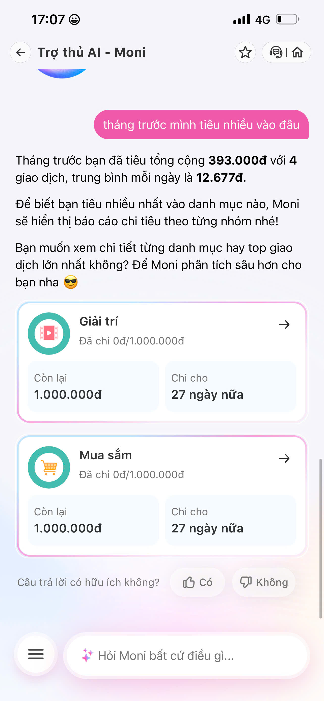

# Workshop - Mổ App AI Thật: MoMo - Moni

**Sản phẩm chọn:** MoMo - Moni  
**AI feature:** Trợ thủ tài chính AI, quản lý chi tiêu, phân tích giao dịch, chatbot hỗ trợ người dùng  
**Người thực hiện:** Trần Trúc Quỳnh  
**Output:** finding note + sketch `as-is / to-be`

## 1. Lý do chọn sản phẩm

MoMo - Moni là một tính năng AI gắn với workflow tài chính cá nhân hằng ngày: thanh toán, xem lại giao dịch, phân loại chi tiêu, ghi chép khoản chi và nhận gợi ý quản lý tiền. Đây là một use case phù hợp để mổ app AI thật vì:

- User có dữ liệu thật và nhu cầu thật: muốn biết tiền đi đâu, có vượt ngân sách không, nên cắt giảm khoản nào.
- AI không chỉ trả lời câu hỏi, mà còn cần gắn với dữ liệu giao dịch và hành động trong app.
- Nếu AI sai hoặc mơ hồ, hậu quả không chỉ là "trả lời sai" mà có thể làm user mất niềm tin vào số liệu tài chính.

## 2. Promise vs Reality

### Product hứa gì?

Theo các trang giới thiệu của MoMo, MoMo định vị mình là "Trợ thủ Tài chính với AI". Riêng nhóm tính năng quản lý chi tiêu/Moni hứa sẽ giúp user:

- Tự động ghi nhận và phân loại giao dịch khi user thanh toán qua MoMo.
- Cho user xem bức tranh chi tiêu theo danh mục, thời gian, nguồn tiền.
- Hỗ trợ nhập giao dịch thủ công khi có khoản chi ngoài MoMo.
- Dùng AI/chatbot để giải thích chi tiêu, đưa lời khuyên và gợi ý quản lý tài chính cá nhân.

Nguồn tham khảo:

- MoMo - Trợ thủ Tài chính với AI: https://www.momo.vn/tro-thu-tai-chinh
- Quản lý chi tiêu MoMo: https://www.momo.vn/quan-ly-chi-tieu
- MoMo Careers - đội ngũ đứng sau trợ lý ảo Moni: https://momo.careers/blog/momo-tech-pioneers-the-minds-behind-ai-advancement-doi-ngu-dung-sau-tro-ly-ao-moni-2152

### User nào được hứa sẽ được giúp?

User chính là người dùng MoMo có nhiều giao dịch nhỏ trong ngày, đặc biệt là sinh viên/người đi làm trẻ, thường thanh toán ăn uống, di chuyển, mua sắm, hóa đơn qua ví điện tử. Nhóm user này không muốn tự ghi sổ chi tiêu bằng Excel hay app riêng, nhưng vẫn muốn biết:

- Tháng trước mình tiêu nhiều nhất vào đâu?
- Khoản nào là cần thiết, khoản nào có thể cắt giảm?
- Giao dịch nào bị phân loại sai?
- Nếu thêm một khoản chi ngoài MoMo thì tổng chi tiêu có còn đúng không?

### Kỳ vọng AI làm được task nào?

Task kỳ vọng:

```text
User hỏi: "Tháng trước mình tiêu nhiều vào đâu?"
AI đọc dữ liệu chi tiêu, gom nhóm giao dịch theo danh mục, đưa ra 2-3 danh mục lớn nhất, nếu có giao dịch chưa rõ thì hỏi lại hoặc đánh dấu cần xác nhận.
```

Kỳ vọng không chỉ là AI trả lời bằng text, mà phải giúp user đi tiếp:

- Bấm vào danh mục để xem các giao dịch gốc.
- Sửa danh mục nếu AI phân loại sai.
- Lưu correction để lần sau phân loại đúng hơn.
- Gợi ý hành động nhỏ, ví dụ đặt hạn mức ăn uống hoặc nhắc khi sắp vượt ngân sách.

### Khi dùng thật, điểm gãy xuất hiện ở đâu?

**Observation từ app thật:**

- Screenshot: màn hình "Trợ thủ AI - Moni" trong app MoMo sau khi hỏi về chi tiêu tháng trước.
- Prompt/input đã thử: `tháng trước mình tiêu nhiều vào đâu`
- Moni trả lời rằng tháng trước user đã tiêu tổng cộng `393.000đ` với `4 giao dịch`, trung bình mỗi ngày là `12.677đ`.
- Moni chưa trả lời trực tiếp danh mục tiêu nhiều nhất, mà nói sẽ hiển thị báo cáo chi tiêu theo từng nhóm và hỏi user muốn xem chi tiết từng danh mục hay top giao dịch lớn nhất không.
- Trong màn hình đi kèm, các card danh mục "Giải trí" và "Mua sắm" lại hiển thị `Đã chi 0đ/1.000.000đ`, tạo cảm giác mâu thuẫn với tổng chi tiêu `393.000đ`.

Quan sát được đưa vào report:

```text
Khi tôi hỏi "tháng trước mình tiêu nhiều vào đâu",
Moni trả lời "Tháng trước bạn đã tiêu tổng cộng 393.000đ với 4 giao dịch, trung bình mỗi ngày là 12.677đ."
Điểm gãy là Moni chưa trả lời trực tiếp "tiêu nhiều vào đâu", chưa nêu danh mục hoặc giao dịch lớn nhất ngay trong câu trả lời đầu tiên.
Vì user đang hỏi để ra quyết định nhanh, nhưng phải hỏi tiếp hoặc bấm tiếp mới biết danh mục/top giao dịch nào là chính.
```

Finding dựa trên quan sát thật: AI có thể đọc được tổng chi tiêu, nhưng câu trả lời chưa khớp hoàn toàn với intent "tiêu nhiều vào đâu"; đồng thời phần card danh mục hiển thị 0đ khiến user khó hiểu dữ liệu nào đang được tính.

## 3. Evidence

| Loại evidence | Nội dung |
|---|---|
| Screenshot | Đã có ảnh màn hình "Trợ thủ AI - Moni" trong app MoMo |
| Quote từ sản phẩm/nguồn công khai | MoMo giới thiệu mình là trợ thủ tài chính với AI; tính năng Quản lý chi tiêu có tự động phân loại giao dịch và hỗ trợ user theo dõi chi tiêu |
| Prompt/input đã thử | `tháng trước mình tiêu nhiều vào đâu` |
| Câu trả lời thật của Moni | "Tháng trước bạn đã tiêu tổng cộng 393.000đ với 4 giao dịch, trung bình mỗi ngày là 12.677đ. Để biết bạn tiêu nhiều nhất vào danh mục nào, Moni sẽ hiển thị báo cáo chi tiêu theo từng nhóm nhé! Bạn muốn xem chi tiết từng danh mục hay top giao dịch lớn nhất không? Để Moni phân tích sâu hơn cho bạn nha 😎" |
| Hành vi quan sát | Moni đọc được tổng chi tiêu, số giao dịch và trung bình/ngày, nhưng chưa đưa ngay danh mục/top giao dịch tiêu nhiều nhất; các card danh mục bên dưới đang hiển thị 0đ nên chưa giải thích được 393.000đ nằm ở đâu |

**Screenshot evidence:**



## 4. Four Paths

| Path | As-is trong Moni | Rủi ro / điểm cần xem | To-be để xây tốt hơn |
|---|---|---|---|
| Happy | User hỏi câu rõ, AI đọc được tổng chi tiêu, số giao dịch và trung bình/ngày | Câu trả lời mới dừng ở tổng quan, chưa trả lời trực tiếp danh mục/top giao dịch lớn nhất | Trả lời ngay top danh mục/top giao dịch, kèm số tiền, tỉ lệ và nút xem chi tiết |
| Low-confidence | Khi Moni chưa chắc nên xem theo danh mục hay top giao dịch, hệ thống hỏi tiếp user muốn xem kiểu nào | Hỏi tiếp là tốt, nhưng chưa nêu được lựa chọn mặc định hoặc preview nhanh | Vừa hỏi tiếp vừa đưa preview: "Có vẻ khoản lớn nhất nằm ở X, bạn muốn xem theo danh mục hay giao dịch?" |
| Failure | Câu hỏi là "tiêu nhiều vào đâu" nhưng Moni chưa trả lời "đâu"; card Giải trí/Mua sắm hiển thị 0đ dù tổng chi là 393.000đ | User có thể thấy dữ liệu mâu thuẫn và không biết 393.000đ thuộc nhóm nào | Cho xem danh sách giao dịch tạo ra tổng 393.000đ, nêu rõ giao dịch nào chưa được gán danh mục |
| Correction | User có thể sửa danh mục ở nơi khác trong app, nhưng correction có thể không rõ là đã được AI ghi nhớ hay chưa | Lần sau user không biết hệ thống có học từ sửa đổi không | Sau khi sửa, hệ thống xác nhận: "Đã ghi nhớ: giao dịch từ merchant X sẽ ưu tiên danh mục Ăn uống" |

## 5. Finding thành product decision

```text
Khi user hỏi Moni "tháng trước mình tiêu nhiều vào đâu",
AI/product đọc được tổng chi tiêu 393.000đ và 4 giao dịch, nhưng chưa trả lời trực tiếp danh mục hoặc giao dịch lớn nhất; thay vào đó hệ thống hỏi user muốn xem chi tiết danh mục hay top giao dịch.
Hậu quả là user chưa nhận được insight chính ở lượt trả lời đầu tiên, đồng thời các card danh mục hiển thị 0đ làm user nghi ngờ dữ liệu tổng 393.000đ đang được tính từ đâu.
Lỗi thuộc layer Intent + Data-tool + UX Recovery.
Nên sửa bằng response mặc định có insight trước, lựa chọn sau: Moni cần trả ngay top danh mục/top giao dịch lớn nhất, kèm các giao dịch gốc tạo ra tổng tiền; nếu danh mục chưa rõ thì đánh dấu "chưa phân loại" hoặc "cần xác nhận" và cho user sửa ngay trong flow chat.
```

## 6. Product requirement để đưa vào SPEC

Nếu nhóm build prototype dựa trên finding này, SPEC nên có một requirement rõ:

```text
Prototype giúp user hỏi về chi tiêu tháng trước và nhận phân tích theo danh mục/top giao dịch.
Mỗi câu trả lời của AI phải kèm:
1. Tổng số tiền theo 2-3 danh mục lớn nhất.
2. Các giao dịch gốc dùng để tính kết quả.
3. Trạng thái confidence cho giao dịch mơ hồ.
4. Cách user sửa nhanh danh mục.
5. Sau khi sửa, hệ thống xác nhận correction đã được lưu.
6. Nếu chưa đủ dữ liệu để kết luận, hệ thống phải nói rõ "chưa phân loại" thay vì hiển thị danh mục 0đ gây hiểu nhầm.
```

Decision Auto/Aug:

- AI nên **augment**, không nên tự động quyết định toàn bộ.
- AI có thể gợi ý danh mục và insight.
- User giữ quyền xác nhận/sửa danh mục, vì đây là dữ liệu tài chính cá nhân.

## 7. Sketch As-is / To-be

### As-is

```text
User mở MoMo
  -> vào Moni / Quản lý chi tiêu
  -> hỏi: "tháng trước mình tiêu nhiều vào đâu"
  -> AI trả lời tổng chi 393.000đ, 4 giao dịch, trung bình/ngày 12.677đ
  -> AI hỏi user muốn xem theo danh mục hay top giao dịch
  -> bên dưới hiện card Giải trí/Mua sắm nhưng đều là 0đ
  -> [ĐIỂM GÃY] user vẫn chưa biết khoản 393.000đ nằm ở danh mục/giao dịch nào
  -> user phải hỏi tiếp hoặc tự bấm vào báo cáo để tìm
```

### To-be

```text
User mở Moni
  -> hỏi: "tháng trước mình tiêu nhiều vào đâu"
  -> AI trả lời:
       Tổng chi: 393.000đ / 4 giao dịch
       Top 1: [danh mục hoặc giao dịch lớn nhất] - xxx.xxxđ
       Chưa phân loại: [nếu có] - xx.xxxđ
  -> dưới insight có 2 nút: "Xem theo danh mục" và "Xem top giao dịch"
  -> AI đánh dấu giao dịch mơ hồ: "Cần xác nhận danh mục"
  -> user chọn lại danh mục đúng
  -> hệ thống cập nhật báo cáo ngay
  -> hệ thống xác nhận correction đã được lưu cho lần sau
```

## 8. Test case để kiểm tra prototype

| Test case | Input | Expected output |
|---|---|---|
| Happy path | "tháng trước mình tiêu nhiều vào đâu" | AI trả về tổng tiền 393.000đ, top danh mục/top giao dịch, giao dịch gốc |
| Low-confidence | Giao dịch có nội dung "ck tiền hôm qua" | AI không tự gán chắc chắn, hỏi user chọn danh mục |
| Failure recovery | User bấm "Sai danh mục" | UI cho chọn danh mục mới và tính lại tổng |
| Correction | User sửa "Highlands 45k" từ Khác sang Ăn uống | Hệ thống xác nhận đã lưu correction/preference |

## 9. Tự kiểm trước khi nộp

- [x] Có ít nhất 1 screenshot từ app MoMo.
- [x] Có quote hoặc observation cụ thể từ Moni.
- [x] Có đủ 4 paths: Happy, Low-confidence, Failure, Correction.
- [x] Finding được viết thành product decision.
- [x] Sketch có as-is và to-be.
- [x] Có câu nói rõ finding này sẽ đổi gì trong SPEC.

## 10. Thông tin có thể bổ sung thêm nếu muốn report mạnh hơn

Report hiện đã đủ evidence chính. Nếu muốn làm mạnh hơn, có thể bổ sung thêm:

1. Một screenshot sau khi bấm vào danh mục hoặc top giao dịch.
2. Danh sách 4 giao dịch tạo ra tổng `393.000đ`, nếu app cho xem.
3. Thử hỏi tiếp: `cho mình xem top giao dịch lớn nhất` để kiểm tra Moni có recovery tốt không.
